# Frequentyly Asked Questions (FAQ)

## Rumie-Build FAQ

### 1. I am getting an error message that says no workshops found. How can I troubleshoot?
  - _Clear your cache._
  - _Change web browsers (we recommend Google Chrome)._
  - _Return to_ [_build.rumie.org_](http://build.rumie.org)

### 2. Can I access Rumie-Build on my phone?
  - _While Rumie-Learn is optimized for the mobile experience, the mobile experience of Rumie-Build is unstable and we recommend using a desktop or laptop computer to build your Byte._

### 3. How do I delete a quiz question?
  - _Select the three dots in the top right corner of the content step. Select "Delete Quiz."_  

  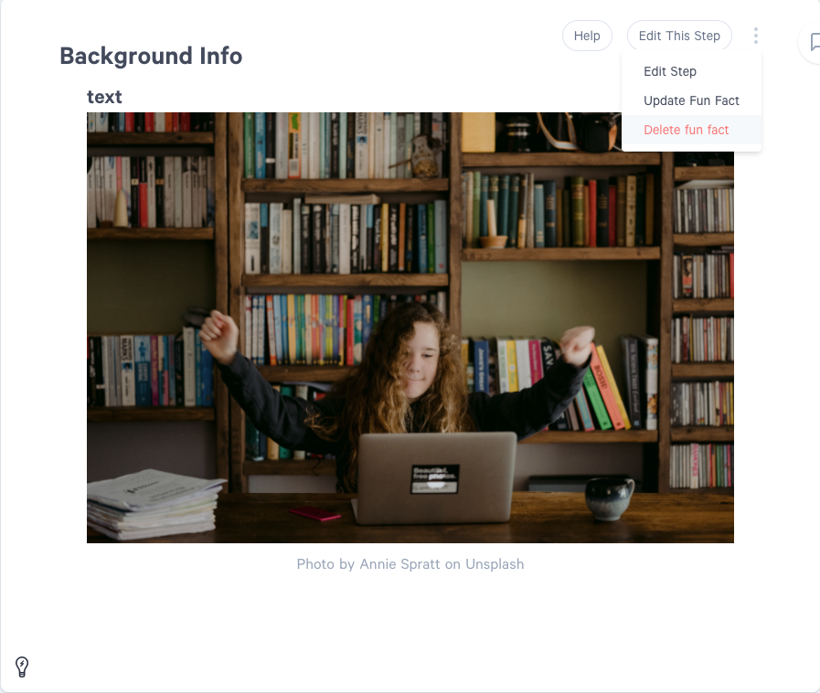

### 4. How do I change the title of my Byte?
  - _When you are ready to submit your Byte for Rumie Review, select "Publish" in Rumie-Build. You will have an opportunity to retitle your Byte. Please use the title case._

### 5. How do I change my Learning Objective?
  - _Edit the LO in ClickUp and in the introduction of your Byte. You will retitle your Byte when you "Publish" prior to Rumie Review._

### 6. How do I delete a fun fact?
  - _Select the three dots in the top right corner of the content step. Select "Delete Fun Fact."_

    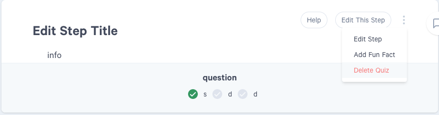

### 7. How do I add a start or end time to a Youtube video?
  - _When you insert a Youtube video, select "Show Advanced Options." You can then enter a start and/or end time for the video. This option is only accessible when you initially add a Youtube video. If you want to add or adjust this later, you will have to delete and re-add the video._

    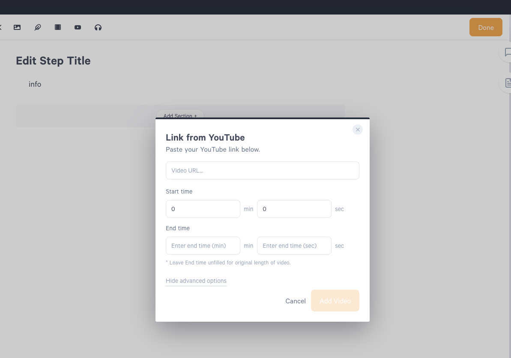

### 8. How can I edit my profile?
  - _Select your initials in the top right corner of Rumie-Build. Then select "My Profile."_

    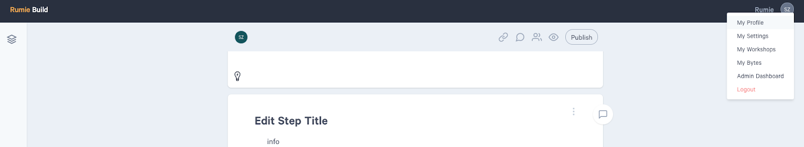

### 9. How can I access "my" in progress Bytes?
  - _Select your initials in the top right corner of Rumie-Build. Then select "My Bytes."_

    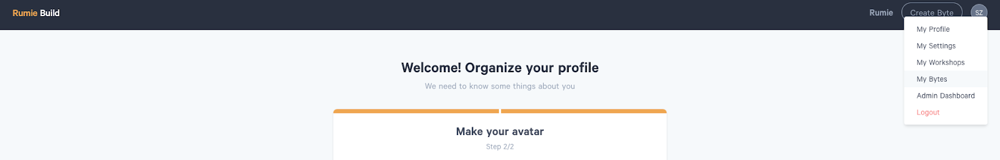

### 10. Can I reduce the credit size for photo credits?
  - _No. At present credit size for photos is not editable._

### 11. When inserting an icon, what are my formatting options?
  - _Icons automatically appear centred within the section they are added to. In order to have icons appear beside the text, use the 2 column section layout. (However, these will appear stacked vertically in mobile view.)_

    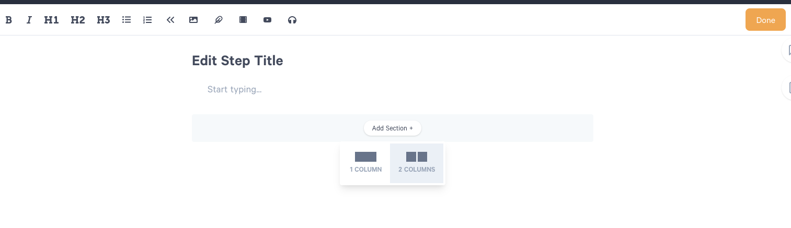

    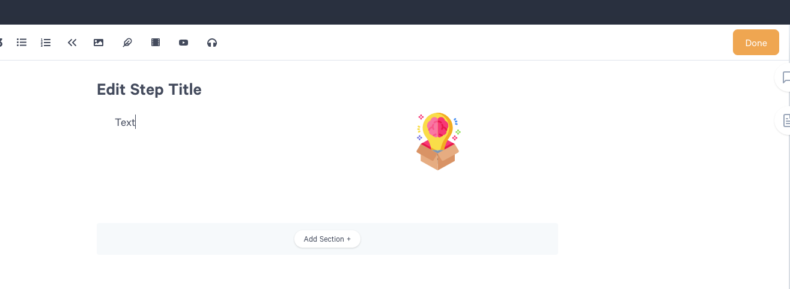

### 12. How can I preview my Byte?
  - _Select the eyeball icon at the top right of Rumie-Build. This will show you the published view of your Byte. Then, select the phone icon to toggle to mobile preview._

    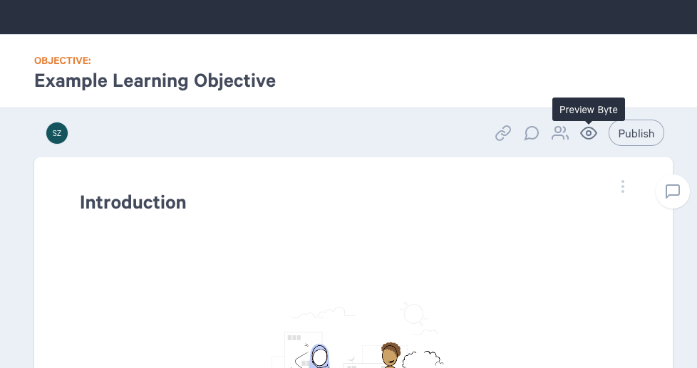

    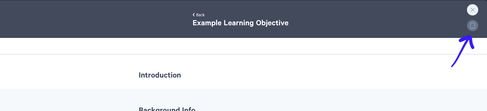

### 13. How can I delete an image?
  - _Put your cursor to the right of the image (or on the next line) and press backspace on your keyboard._

### 14. How can I delete a video?
  - _Put your cursor to the right of the video (or on the next line) and press backspace on your keyboard._

### 15. How can I delete a content step?
  - _Select the rectangle steps on the left side panel of Rumie-Build. Then select the three dots to the right of the content step you would like to delete and choose "Delete Step."_

    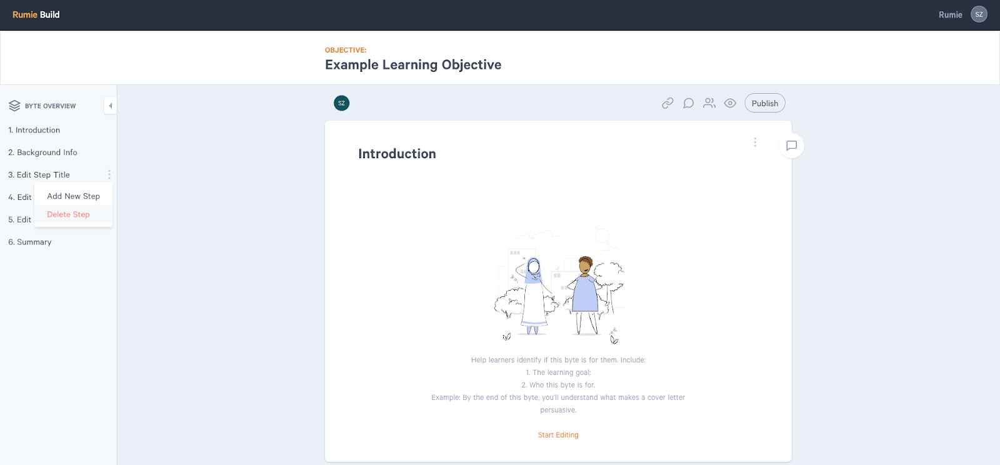

### 16. How can I delete a section?
  - _Hover your cursor over the section you want to delete. Then click the garbage icon._

    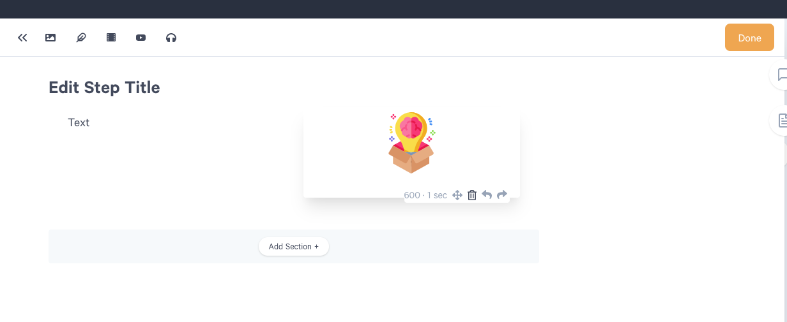

### 17. Can I add an image or video to the Introduction?
  - _No. The introduction is the only step that cannot have media. The text from the introduction is used to populate the Byte preview._

### 18. Can I rearrange the content steps?
  - _Not at this time. We will be developing this feature._

## Click-up FAQ

### 1. Where do I put my Byte URL?
  - _Put your Byte URL under the "Byte URL" field. You may need to click "Show empty fields."_

    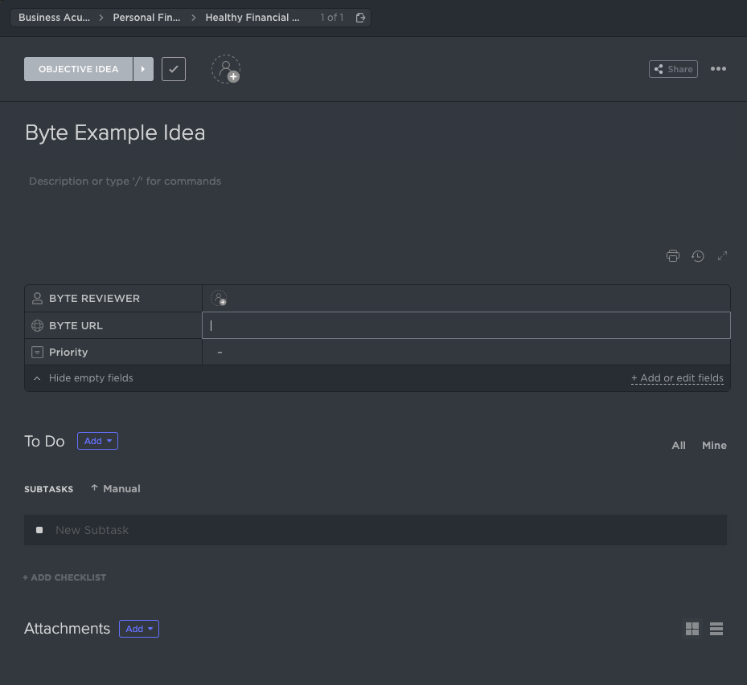

### 2. Can I claim a Learning Objective written by someone else?
  - _Yes. Any LO's without an assignee is considered to be up for grabs._

### 3. How should I deliver my peer review?
  - _Deliver your peer review feedback as 1 comment in ClickUp and/or as comments embedded directly in the Byte._

### 4. When do I change the status during a peer review?
  - _After you complete a peer review, change the Byte status._ 
_If you are the first person to review, change the status to "Byte for Peer Review 2." If you are the second person to review, change the status to "Byte Revisions in Progress."_

### 5. Does it matter who peer reviews first?
  - _No. Peer reviewers are all equal and can review in any order based on their individual schedules._

### 6. Which Bytes am I assigned to peer review?
  - _In your individual dashboard, there is a widget called "Bytes for Peer Review." As your squad lead assigns you Bytes to peer review, they will appear here each sprint._

    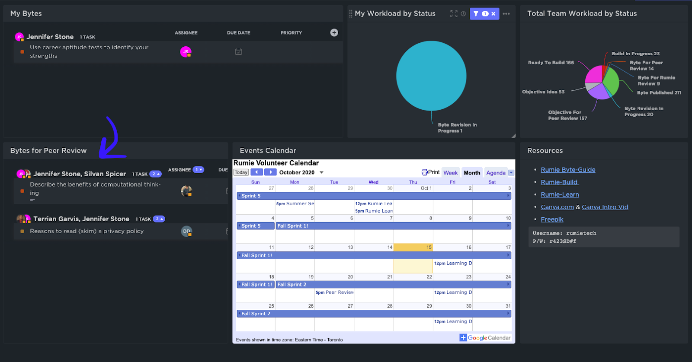

### 7. When do I change the status to "Byte Published"?
  - _Never change the Byte status to "Byte Published." When you publish the Byte in Rumie-Build, change the status to "Byte for Rumie Review." Rumie will change the status to "Byte Published" after approving the Byte. You will receive an email when your Byte is live on Rumie-Learn._

