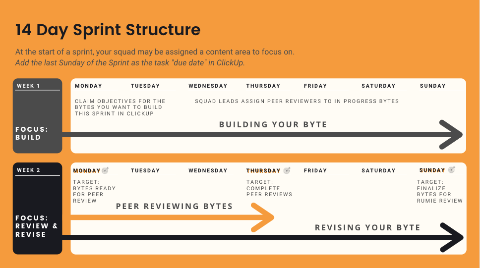

# Learning Design Team Workflow

## Team Structure

* The Learning Design Team is broken down into squads.
* Each squad has a **Squad Lead** who is the first point of contact for troubleshooting and answering questions related to the Byte Building process.
* Squad leads are responsible for assigning peer reviewers within the squad each sprint.
* Each squad has a **Byte Advisor** who is an experienced Rumie volunteer with proven Learning Design skills. This person is a resource for squad members to ask questions related to learning design. 
* Rumie also has designated **Gatekeepers** who review Bytes after the peer review process, before final publishing. Gatekeepers are responsible for ensuring that all Bytes align with Rumie standards.

## Slack

_Slack Workspace Introductory_ [<u>video</u>](https://youtu.be/zAQv86_u4Ww)

* The Learning Design Team uses Slack as our communications hub. 
* There are channels for the full team and a private channel for your squad.

## Sprints

The Learning Design team follows a 14-day sprint structure, outlined below.

* Sprint content areas will be communicated via Slack prior to the start of each sprint.
* The sprint is a guide but not hard deadlines. If you are delayed or need more time, communicate this with your squad lead via slack.
Occasionally, we will take a week between sprints as a "Catch-Up and Learning Objectives" week.
* This week is intended as an opportunity for all team members to tie up any outstanding loose ends, author, and review learning objectives on the topic of focus.   

## Rumie-Build

_Rumie-Build Introductory_ [<u>video</u>](https://youtube.com/playlist?list=PLI0ZVSELogCcavv64HhD-yUeFrZpW32gR)

* Bytes are built-in Rumie-Build.
* Upon completion of onboarding, Learning Designers will be emailed a link to access Rumie-Build.
  - The first time Learning Designers access the link, they will be prompted to create a profile. _Learning Designers are encouraged to use the "Advanced Options" to add a bio and link to your external presence._
  - Learning Designers will use the same link to build all of their Bytes.
  - Rumie-Build will keep you automatically logged in at the end of your session. (Don't click "Log Out" unless you are on a public computer.)

## ClickUp

* Byte status' are tracked in ClickUp.
* Upon completion of onboarding, Learning Designers will receive an invitation to join ClickUp. 

### Statuses

_ClickUp Process_ [<u>video</u>](https://youtu.be/ogNqbqZ7FDE)

As you move through the sprint process (authoring, peer review, and revision,) you will update the status of your Byte in ClickUp. The statuses are:

|  |  |
| --- | --- |
| The objective for Peer Review | * This is an objective that is ready for the second set of eyes.   * Reviewers, consider the objective in the context of the guidelines.   * Make changes directly to the LO, or @tag the author with comments.   * Once the reviewer 'blesses' the objective, the reviewer changes the status.   |
| Ready to Build | * This is an objective that has been peer-reviewed and is ready to be built into a Byte.   * Ready to Build objectives are considered 'up for grabs' until/unless someone has claimed it by making themself the 'assignee.'   * Once you claim an objective (by making yourself the "assignee" at the start of a sprint), change the status to "Build In Progress".   |
| Build-in Progress | * This indicates that you are currently working on your first draft of the Byte.   * Add the Byte URL from Rumie-Build.   * Change the status when you have completed your first draft of the Byte to "Byte for Peer Review" (at the end of week 1 of the sprint).  |
| Byte for Peer Review | * This indicates that the Byte draft is complete and ready for peer review.   * **Peer reviewers may review in any order** using the Peer Review Checklist.   * Peer reviewers make comments by leaving comments directly in the Byte using the comments feature.   * After giving comments, the first person to peer review changes the status to "Byte for Peer Review 2". |
| Byte for Peer Review 2 | * This indicates that the Byte draft has received one set of peer review comments.   * Peer reviewers may review in any order using the Peer Review Checklist.   * Peer reviewers make comments directly in the Byte using the comments feature.   * After giving comments, the second person to peer review changes the status to "Revisions in Progress".   |
| Revisions in Progress | * This indicates that you are incorporating peer review feedback to finalize your Byte.   * After finalizing, click "Submit for Review" in Rumie Build. - Select a cover photo - Retitle the Byte - Categorize according to category/topic/theme - Select appropriate timing   * Change the Byte status after publishing to "Byte for Rumie Review".   |
| Byte for Rumie Review | * This indicates that the Byte is ready for Rumie review.   * A Rumie Gatekeeper will review the Byte in correspondence with the Approval Guidelines.   * Rumie will change the status after reviewing the Byte.   |
| Byte for Approval | * This indicates that the Byte is ready to be tagged and published to Rumie-Learn. Rumie will change the status after publishing the Byte.   |
| Byte Published | * This indicates that the Byte is live on Rumie-Learn.   |

### ClickUp Dashboard

* Access your individual dashboard by clicking the icon on the left-hand side (below the bell icon).
* The individual dashboard shows the Bytes you are authoring and assigned for peer review. 
It also has:
    + Events calendar
    + Links to additional resources
    + Total team metrics (# of Bytes at each status).
